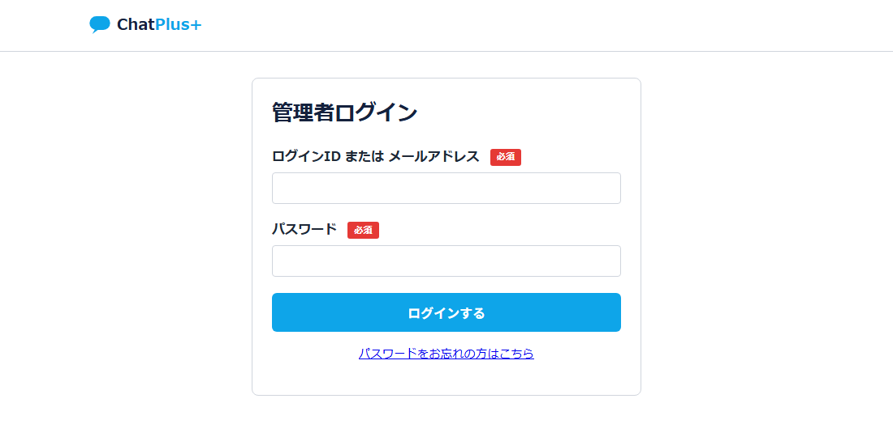
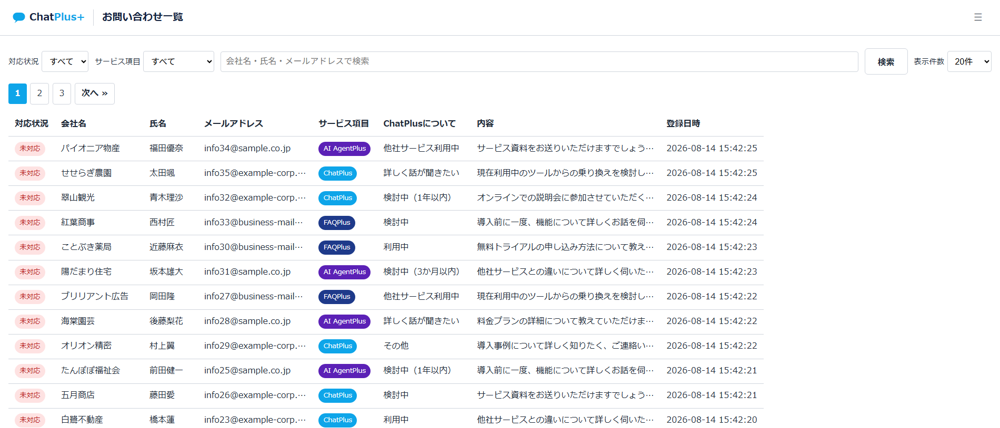
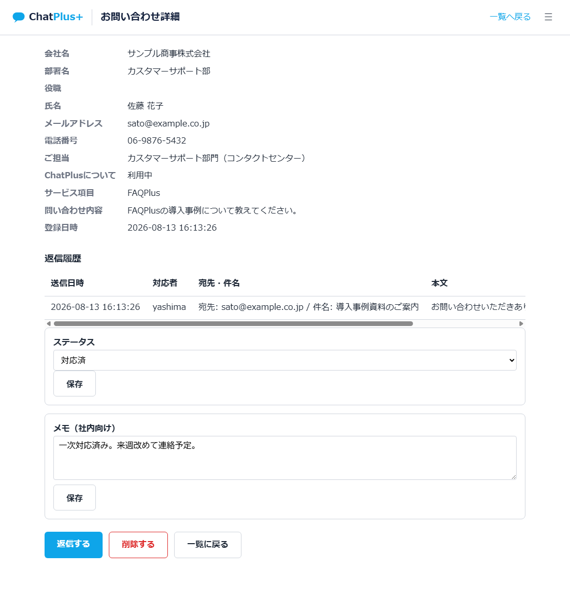
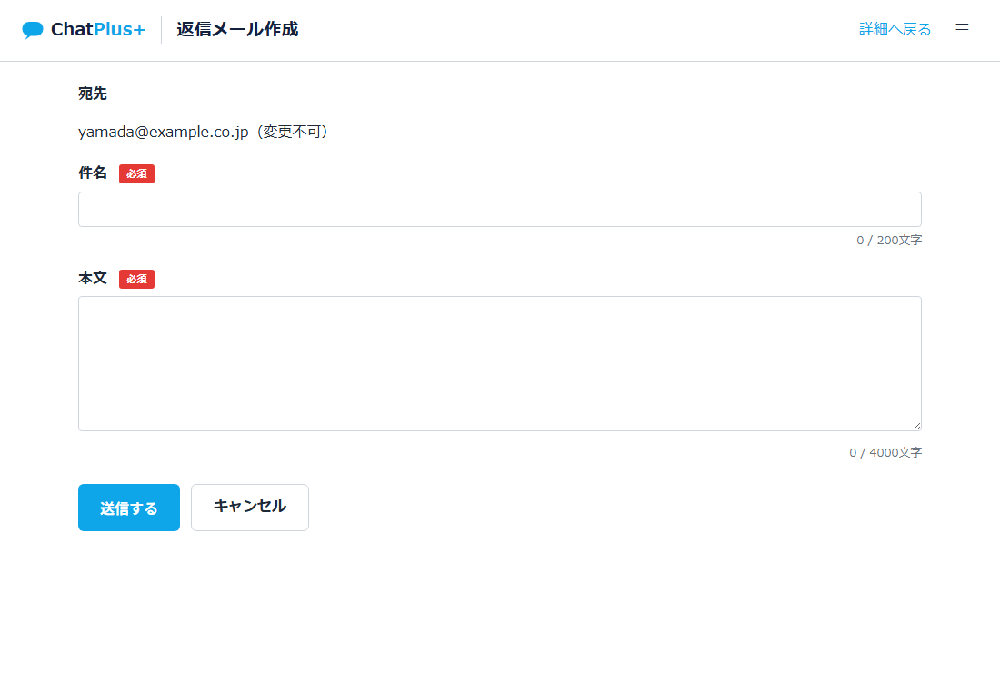
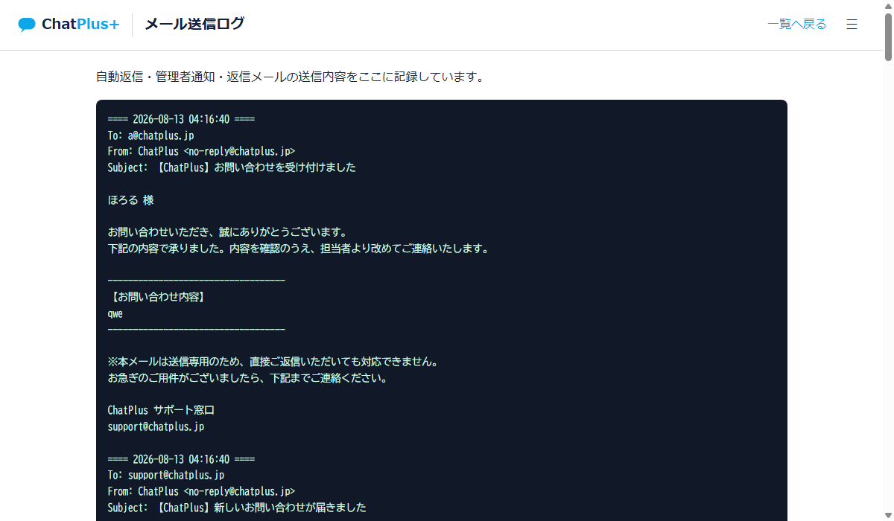
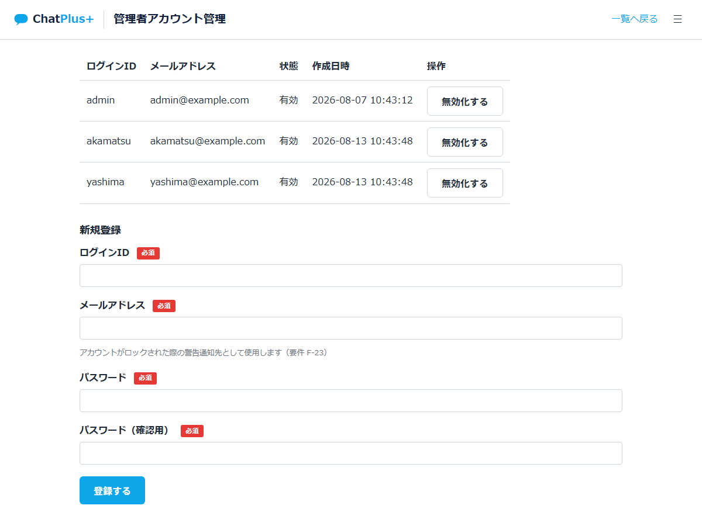
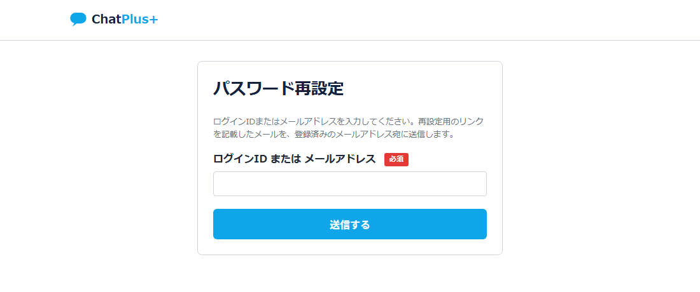

# ChatPlus お問い合わせ管理システム 運用マニュアル

このマニュアルは、Webサイトから届く「お問い合わせ」を管理画面で確認・対応するためのマニュアルです。パソコンの専門的な知識は必要ありません。

## 目次

1. [このシステムでできること](#1-このシステムでできること)
2. [ログイン方法](#2-ログイン方法)
3. [お問い合わせ一覧の見方](#3-お問い合わせ一覧の見方)
4. [お問い合わせの詳細を確認する](#4-お問い合わせの詳細を確認する)
5. [お問い合わせに返信する](#5-お問い合わせに返信する)
6. [お問い合わせを削除する](#6-お問い合わせを削除する)
7. [送信したメールの履歴を確認する](#7-送信したメールの履歴を確認する)
8. [管理者アカウントを管理する](#8-管理者アカウントを管理する)
9. [パスワードを忘れた・変更したいとき](#9-パスワードを忘れた変更したいとき)
10. [ログインできないとき（アカウントロック）](#10-ログインできないときアカウントロック)
11. [よくある質問](#11-よくある質問)

---

## 1. このシステムでできること

Webサイトのお問い合わせフォームから送信された内容が、自動的にこのシステムに保存されます。管理画面にログインすると、次のことができます。

- 届いたお問い合わせを一覧で確認する
- 対応状況（未対応・対応済）を管理する
- お問い合わせ元へメールで返信する
- 社内向けのメモを残す
- 対応不要になったお問い合わせを削除する
- 管理者アカウント（ログインできる人）を管理する

---

## 2. ログイン方法

> お問い合わせフォーム（お客様向けの画面）には、この管理画面へのリンクは設置されていません。一般の訪問者の目に触れないようにするためです。管理画面をお使いになる際は、下記のURLを直接ブラウザに入力するか、ブックマークしてご利用ください。

1. ブラウザで管理画面のURL（担当者から共有されたもの。ローカルで確認する場合は `http://localhost:8000/login.php`）を開きます。
2. 「ログインID または メールアドレス」の欄に、ログインIDと登録済みのメールアドレスのどちらかを入力し、「パスワード」を入力します（ログインIDを忘れてしまった場合は、代わりにメールアドレスでログインできます）。
3. 「ログインする」ボタンを押します。

ログインに成功すると、お問い合わせ一覧の画面が表示されます。

---

## 3. お問い合わせ一覧の見方

ログイン後、最初に表示されるのがこの一覧画面です。届いたお問い合わせが新しい順に並びます。

### 画面の見方

| 項目 | 内容 |
|------|------|
| 対応状況 | 「未対応」（赤）／「対応済」（グレー）のバッジで一目で分かります |
| サービス項目 | ChatPlus（水色）／FAQPlus（紺色）／AI AgentPlus（濃い紫）の色で区別されます |
| 行をクリック | その お問い合わせの詳細画面に移動します |

### 絞り込み・検索

画面上部で、以下の条件を組み合わせて絞り込めます。

- **対応状況**: 「すべて」「未対応」「対応済」から選択
- **サービス項目**: 「すべて」「ChatPlus」「FAQPlus」「AI AgentPlus」から選択
- **キーワード検索**: 会社名・氏名・メールアドレスの一部を入力して「検索」を押す
- **表示件数**: 1ページに表示する件数を20件／50件／100件から選択

---

## 4. お問い合わせの詳細を確認する

一覧で行をクリックすると、詳細画面が開きます。

この画面でできること:

- **入力内容の確認**: 会社名・氏名・連絡先など、お問い合わせフォームに入力された内容がすべて表示されます
- **返信履歴の確認**: このお問い合わせにこれまで返信した内容（日時・担当者・件名・本文）が確認できます
- **対応状況の変更**: プルダウンで「未対応」「対応済」を選び「保存」を押します
- **メモの記入**: 社内向けのメモ（他の担当者への申し送りなど）を書いて「保存」を押します。お問い合わせ元には表示されません
- **返信する**: [5章](#5-お問い合わせに返信する)を参照
- **削除する**: [6章](#6-お問い合わせを削除する)を参照

> メモや対応状況を保存すると、「誰が・いつ」変更したかが自動的に記録されます。

---

## 5. お問い合わせに返信する

1. 詳細画面で「返信する」ボタンを押します。
2. 件名と本文を入力します（宛先はお問い合わせ元のメールアドレスに固定されており、変更できません）。
3. 「送信する」ボタンを押します。

送信すると、そのお問い合わせの対応状況は自動的に「対応済」に変わります。改めて対応状況を変更する必要はありません。

> 送信に失敗した場合はエラーメッセージが表示され、対応状況も「対応済」には変わりません。時間を置いてもう一度お試しください。改善しない場合は他の管理者や担当者にご相談ください。

---

## 6. お問い合わせを削除する

1. 詳細画面で「削除する」ボタンを押します。
2. 確認画面が表示されるので、内容を確認して「削除する」を押します。

**削除すると元に戻せません。** 誤操作を防ぐため、必ず確認画面を経由する仕組みになっています。不要であれば「キャンセル」で詳細画面に戻ってください。

---

## 7. 送信したメールの履歴を確認する

画面右上の「☰」メニューから「メール送信ログ」を選ぶと、これまでにシステムが送信した自動返信・管理者通知・返信メールの内容を確認できます。「相手にメールが届いていないと言われた」際に、実際に送信されたかどうかを確認するのに使えます。

---

## 8. 管理者アカウントを管理する

画面右上の「☰」メニューから「管理者アカウント管理」を選ぶと、ログインできる人を管理できます。

### 新しい管理者を追加する

1. 「新規登録」欄に、ログインID・メールアドレス・パスワード（2回）を入力します。
2. パスワードは **8文字以上で、半角英数字に加えて記号を1文字以上** 含める必要があります（例: `Passw0rd!`）。
3. 「登録する」を押します。

登録したメールアドレスは、そのアカウントが後述の「アカウントロック」になった際の通知先として使われます。

### アカウントを無効化する（利用停止）

対象アカウントの「無効化する」ボタンを押すと、そのアカウントはログインできなくなります。ログイン中の場合も、次の操作で強制的にログアウトされます。**自分自身のアカウントは無効化できません**（誰もログインできなくなる事態を防ぐため）。

再度有効にしたい場合は、同じ場所の「有効化する」ボタンを押します。

> このシステムでは、退職・異動などでアカウントが不要になった場合も削除はせず「無効化」で対応します。過去の対応履歴を保持するためです。

---

## 9. パスワードを忘れた・変更したいとき

自分でパスワードを再設定できます。他の管理者や開発者に連絡する必要はありません。

1. ログイン画面の「パスワードをお忘れの方はこちら」をクリックします。
2. 自分のログインIDまたは登録済みのメールアドレスを入力して「送信する」を押します（ログインIDを忘れてしまった場合は、メールアドレスでも依頼できます）。
3. 登録されているメールアドレス宛に、パスワード再設定用のリンクが記載されたメールが届きます。
4. メール内のリンクをクリックし、新しいパスワードを入力して「設定する」を押します。

> リンクの有効期限は発行から **30分** です。時間が経って無効になった場合は、もう一度最初からやり直してください。
>
> なお、この方法は「パスワードを忘れた」ときだけでなく、「パスワードを変更したい」ときにも使えます。

---

## 10. ログインできないとき（アカウントロック）

パスワードを **5回連続で** 間違えると、そのアカウントは **30分間** ロックされ、ログインできなくなります。

- ロックされた瞬間に、そのアカウントの登録メールアドレス宛に警告メールが届きます。心当たりがない場合は、第三者による不正なログイン試行の可能性があるため、他の管理者にご相談ください。
- 30分経てば自動的にロックが解除されます。急ぐ場合でも、時間を置く以外に解除する方法はありません。
- ロック中でも、パスワード自体は変わっていません。解除後はそのままのパスワードでログインできます。

---

## 11. よくある質問

**Q. お問い合わせへの返信メールが相手に届いていないと言われました。**
A. まず送信先のメールアドレスに誤りがないか、詳細画面で確認してください。相手の迷惑メールフォルダに振り分けられている場合もあります。それでも解決しない場合は、担当者にご確認ください。

**Q. 一覧に表示される件数を増やしたい。**
A. 一覧画面右上の「表示件数」で20件・50件・100件を切り替えられます。

**Q. 対応済にしたお問い合わせを、また未対応に戻せますか。**
A. できます。詳細画面の「対応状況」プルダウンでいつでも変更できます。

**Q. メモは相手に見られますか。**
A. 見られません。メモは管理画面にログインした管理者だけが確認できる、社内向けの項目です。

**Q. スマートフォンからも使えますか。**
A. 使えます。画面幅に応じて表示が調整されます（一覧画面など列の多い画面は横にスクロールして確認してください）。
